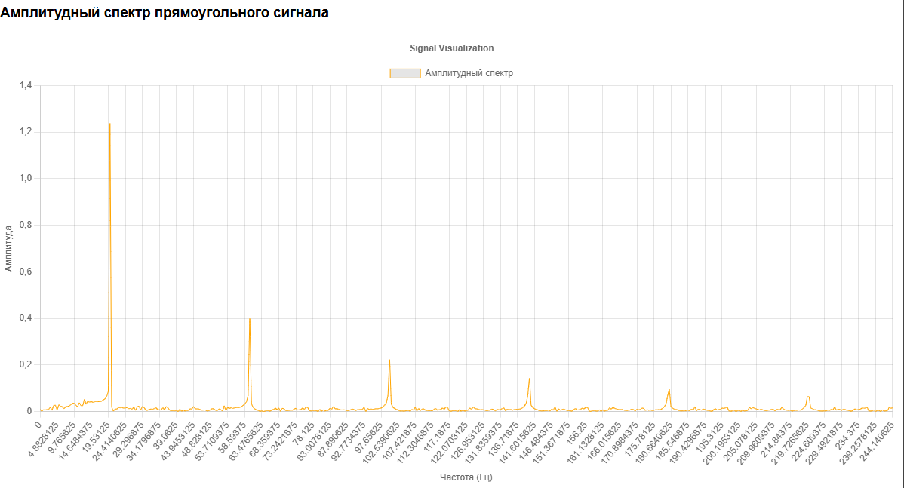

# Лабораторная работа 1: Моделирование гармонического сигнала и операции с ним

## Графики
- 
- 
- 
- 
- 
- 
- 

# Лабораторная работа 2: Моделирование треугольного и прямоугольного сигнала. Вычисление спектра сигнала

## Графики
- 
- 
- 
- 
- 
- 
- 
- 

# Лабораторная работа 4: Моделирование шумов. Изучение их спектральных характеристик

## Графики
- 
- 
- 
- 
- 
- 
- 
- 
- 
